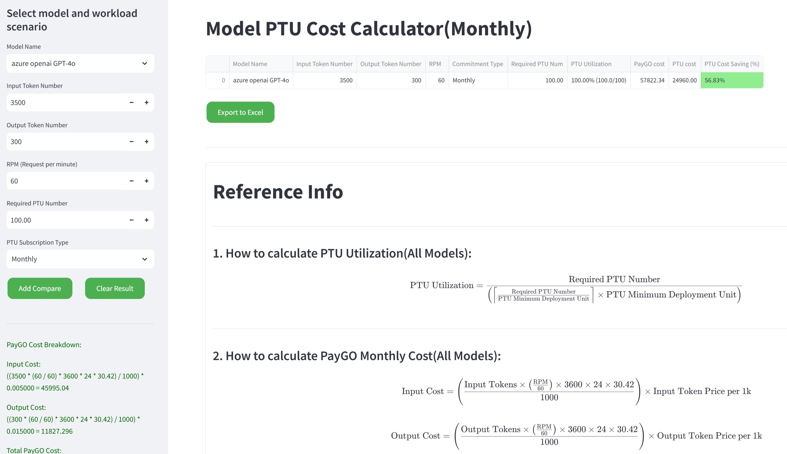

# Model PTU Cost Calculator

## Introduction

This project is designed to calculate the cost of using different AI models based on their token usage and PTU (Provision Throughput Unit) costs. It utilizes various libraries such as `streamlit`, `pandas`, `openpyxl`, and `xlsxwriter` to achieve its functionality.



## Installation Guide

If you don't want to deploy this tool locally, you can access it [here](https://gbb-ptu-cost-compare.streamlit.app).

To set up the project, follow these steps:

1. **Clone the repository:**
   ```bash
   git clone https://github.com/guming3d/ptu_cost_compare_tool.git
   cd ptu_cost_compare_tool
   ```

2. **Create a virtual environment:**
   ```bash
   python3 -m venv venv
   source venv/bin/activate  # On Windows use `venv\Scripts\activate`
   ```

3. **Install the dependencies:**
   ```bash
   pip install -r requirements.txt
   ```

4. **Run the application:**
   ```bash
   streamlit run app.py
   ```

## Usage

### Streamlit Web Application

1. Open your web browser and navigate to the Streamlit application.
2. Use the sidebar to input the following parameters:
   - **Input Token Number**: The number of input tokens.
   - **Output Token Number**: The number of output tokens.
   - **RPM (Request per minute)**: The number of requests per minute.
   - **Model Name**: Select the model from the dropdown list.
   - **PTU Number**: The number of PTUs.
   - **PTU Subscription Type**: Choose between "Monthly" or "Yearly".

3. Click on "Add Compare" to calculate and add the results to the comparison table.
4. Click on "Clear Result" to clear the comparison table.
5. If the comparison table is not empty, click on "Export to Excel" to download the results as an Excel file.

