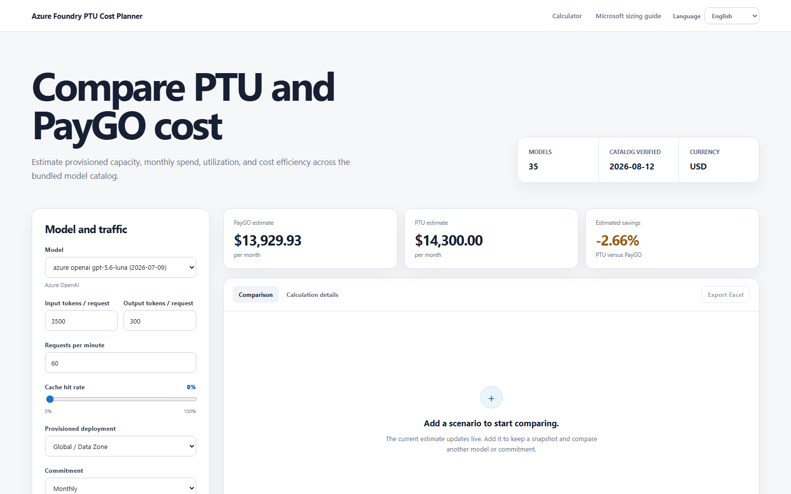

# Azure Foundry PTU Cost Planner

A React and TypeScript calculator for comparing monthly PayGO and provisioned throughput costs. The interface is a responsive Vite single-page application with no Streamlit or Python runtime. A live configuration optimizer recommends the lowest-cost commitment and deployment option for the selected model and charts PayGO against each PTU cost curve as traffic changes.

The bundled catalog includes Azure OpenAI, Fireworks on Microsoft Foundry, and Google models. Azure OpenAI and Fireworks PTUs are estimated automatically with normalized TPM sizing. Microsoft doesn't publish a PTU output-token weight for Fireworks models, so GLM models use a 1:1 ratio and other Fireworks models use their PayGO output-to-input price ratio; users can override the Fireworks estimate with a benchmarked PTU value. Each saved comparison includes a complete calculation trace. The interface supports English and Simplified Chinese, with English displayed by default.

## UI preview



## Development

```bash
npm install
npm run dev
```

Open `http://localhost:5173`.

## Validation

```bash
npm run typecheck
npm test
npm run build
```

## Container

```bash
docker build -t ptu-cost-planner .
docker run --rm -p 8501:80 ptu-cost-planner
```

Open `http://localhost:8501`.

## Catalog

Pricing and throughput metadata remains in `model_config.json`. The in-app catalog editor validates updates and stores them in the browser's local storage. Restoring the bundled catalog clears that local override.

The September 11, 2026 [Microsoft sizing guide](https://learn.microsoft.com/en-us/azure/foundry/openai/how-to/provisioned-throughput-sizing) adds the following model-specific configurations. Other model configurations and the catalog-wide verification date remain unchanged; the new entries carry their own source notes.

| Model | Normalized TPM / PTU | Global / Data Zone minimum / increment | Regional minimum / increment |
| --- | --- | --- | --- |
| `gpt-6-astra (2026-09-03)` | 600 | 15 / 5 | 50 / 50 |
| `gpt-image-2 (2026-04-21)` | 1,200 | 100 / 100 | 100 / 100 |

For Astra, select the applicable short- or long-context pricing tier explicitly; the supplied guide does not specify a context-length cutoff. Input tokens include uncached input, cache reads (the cache-hit percentage), and cache writes (the separate token count). Short-context PTU weights are 1 / 0.1 / 1.25 / 5 for uncached input / reads / writes / output; long-context weights are 2 / 0.2 / 2.5 / **10**. The announced 7.5 long-context output weight is not yet active. PayGO long-context output is still $75 per million tokens. Existing models retain their prior caching behavior.

For GPT-image-2, enter image input and output **token counts**, obtained from API usage or the [input](https://developers.openai.com/api/docs/guides/images-vision#image-input-cost-calculator) and [output](https://developers.openai.com/api/docs/guides/image-generation#gpt-image-25-and-gpt-image-2-output-tokens) token calculators. Normalized TPM is `RPM x (uncached text input + image input x 1.6 + image output x 3.75 x 1.6)`. Image input caching is not modeled; the cache-hit control applies only to text. The guide's example (10 RPM, 2,000 text input, 1,229 image input, 7,024 image output) requires 384.25 raw PTUs and **400 deployed PTUs**.

Astra token prices come from the supplied guide. GPT-image-2 Global Standard prices were checked against the [Azure Retail Prices API](https://prices.azure.com/api/retail/prices) on September 14, 2026: $5/M text input, $1.25/M cached text, $8/M image input, and $30/M image output. PTU reservation pricing uses the existing catalog assumptions ($260 monthly or $221/month annual equivalent). The calculator retains its 30.42-day billing month, rather than the 30-day month used in the guide's illustrative Astra cost comparison.

The calculator is an estimate. Azure pricing can vary by geography, deployment type, currency, and commercial agreement.
